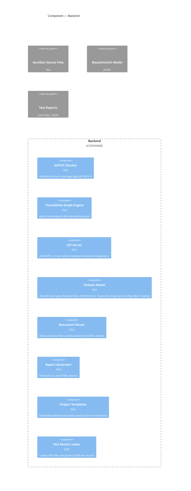

### Component — Backend

```mermaid
C4Component
    title Component — Backend

    System_Ext(data_asciidoc, "AsciiDoc Source Files", "Text", "Requirements, architecture and test-spec blocks in .adoc files")
    System_Ext(data_bausteinsicht, "Bausteinsicht Model", "JSONC", "Architecture model file (architecture.jsonc)")
    System_Ext(data_tests, "Test Reports", "JUnit XML / JSON", "CI-generated test result artifacts")
    Container_Boundary(system_backend, "Backend") {
        Component(system_backend_aspice, "ASPICE Checker", "Go", "Validates process coverage against PAM 4.0")
        Component(system_backend_graph, "Traceability Graph Engine", "Go", "Builds and analyzes the traceability graph")
        Component(system_backend_lsp, "LSP Server", "Go", "JSON-RPC 2.0 over stdio; initialize/completion/diagnostics")
        Component(system_backend_model, "Domain Model", "Go", "Shared data types (Requirement, ArchElement, TraceLink, Graph) and configuration loading")
        Component(system_backend_parser, "Document Parser", "Go", "Parses AsciiDoc files and Bausteinsicht JSONC models")
        Component(system_backend_report, "Report Generator", "Go", "Produces CLI and HTML reports")
        Component(system_backend_templates, "Project Templates", "Go", "Embedded default templates used by the init command")
        Component(system_backend_testresult, "Test Result Loader", "Go", "Loads JUnit XML and go-test JSON test results")
    }
```
