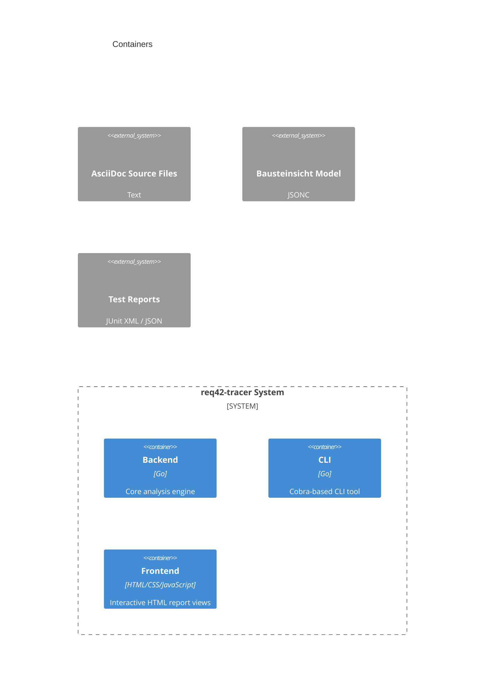

### Container View

```mermaid
C4Container
    title Containers

    System_Ext(data_asciidoc, "AsciiDoc Source Files", "Text", "Requirements, architecture and test-spec blocks in .adoc files")
    System_Ext(data_bausteinsicht, "Bausteinsicht Model", "JSONC", "Architecture model file (architecture.jsonc)")
    System_Ext(data_tests, "Test Reports", "JUnit XML / JSON", "CI-generated test result artifacts")
    System_Boundary(system, "req42-tracer System") {
        Container(system_backend, "Backend", "Go", "Core analysis engine")
        Container(system_cli, "CLI", "Go", "Cobra-based CLI tool")
        Container(system_frontend, "Frontend", "HTML/CSS/JavaScript", "Interactive HTML report views")
    }
```
