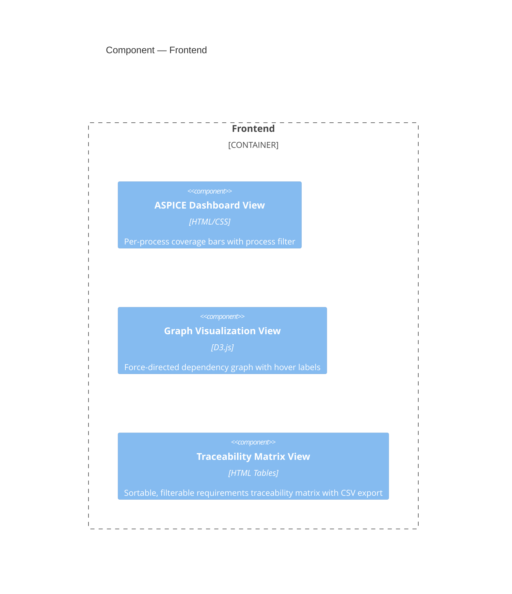

### Component — Frontend

```mermaid
C4Component
    title Component — Frontend

    Container_Boundary(system_frontend, "Frontend") {
        Component(system_frontend_aspice_view, "ASPICE Dashboard View", "HTML/CSS", "Per-process coverage bars with process filter")
        Component(system_frontend_graph_view, "Graph Visualization View", "D3.js", "Force-directed dependency graph with hover labels")
        Component(system_frontend_matrix_view, "Traceability Matrix View", "HTML Tables", "Sortable, filterable requirements traceability matrix with CSV export")
    }
```
